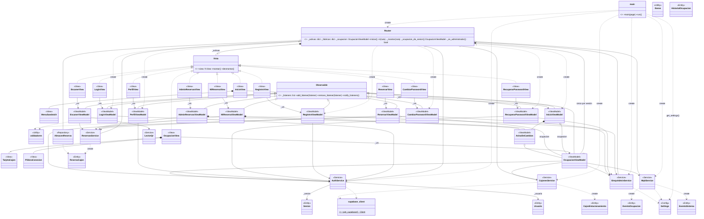

```mermaid
classDiagram
direction TB
class main { <<Bootstrap>> +main(page) +run() }
class Vista { <<Interface>> +view: ft.View +montar() +desmontar() }
class Router { <<Controller>> -_activas: dict -_fabricas: dict -_ocupacion: OcupacionViewModel +iniciar() +ir(ruta) -_mostrar(ruta) -_ocupacion_de_sesion() OcupacionViewModel -_es_administrador() bool }
class Observable { <<Core>> -_listeners: list +add_listener(listener) +remove_listener(listener) +notify_listeners() }
class Settings { <<Config>> }
class validadores { <<Utility>> }
class theme { <<Utility>> }

class LoginView { <<View>> }
class RegistroView { <<View>> }
class RecuperarPasswordView { <<View>> }
class InicioView { <<View>> }
class OcupacionView { <<View>> }
class PerfilView { <<View>> }
class CambiarPasswordView { <<View>> }
class ReservarView { <<View>> }
class MiReservaView { <<View>> }
class AdminReservasView { <<View>> }
class EscanerView { <<View>> }
class MenuSandwich { <<View>> }
class TarjetaCajon { <<View>> }
class PildoraConexion { <<View>> }

class LoginViewModel { <<ViewModel>> }
class RegistroViewModel { <<ViewModel>> }
class RecuperarPasswordViewModel { <<ViewModel>> }
class InicioViewModel { <<ViewModel>> }
class OcupacionViewModel { <<ViewModel>> }
class PerfilViewModel { <<ViewModel>> }
class CambiarPasswordViewModel { <<ViewModel>> }
class ReservarViewModel { <<ViewModel>> }
class MiReservaViewModel { <<ViewModel>> }
class AdminReservasViewModel { <<ViewModel>> }
class EscanerViewModel { <<ViewModel>> }
class AvisoDeCambios { <<ViewModel>> }

class AuthService { <<Service>> }
class EmqxAdminService { <<Service>> }
class CajonesService { <<Service>> }
class MqttService { <<Service>> }
class ReservasService { <<Service>> }
class AlmacenReserva { <<Repository>> }
class LectorQr { <<Service>> }
class supabase_client { <<Factory>> +get_supabase()$ Client }

class Usuario { <<Entity>> }
class Sesion { <<Entity>> }
class CajonEstacionamiento { <<Entity>> }
class EventoOcupacion { <<Entity>> }
class EventoSistema { <<Entity>> }
class ReservaCajon { <<Entity>> }
class HistorialOcupacion { <<Entity>> }

main ..> Router : create
main ..> AuthService : create
main ..> EmqxAdminService : create
main ..> CajonesService : create
main ..> MqttService : create
main ..> Settings : get_settings()

Router "1" *-- "0..*" Vista : _activas
Router o-- AuthService
Router o-- EmqxAdminService
Router o-- CajonesService
Router o-- MqttService
Router o-- ReservasService
Router o-- AlmacenReserva
Router "1" *-- "0..1" OcupacionViewModel : único por sesión
Router ..> LoginViewModel : create
Router ..> RegistroViewModel : create
Router ..> RecuperarPasswordViewModel : create
Router ..> InicioViewModel : create
Router ..> PerfilViewModel : create
Router ..> CambiarPasswordViewModel : create

Vista <|.. LoginView
Vista <|.. RegistroView
Vista <|.. RecuperarPasswordView
Vista <|.. InicioView
Vista <|.. OcupacionView
Vista <|.. PerfilView
Vista <|.. CambiarPasswordView
Vista <|.. ReservarView
Vista <|.. MiReservaView
Vista <|.. AdminReservasView
Vista <|.. EscanerView

Observable <|-- LoginViewModel
Observable <|-- RegistroViewModel
Observable <|-- RecuperarPasswordViewModel
Observable <|-- InicioViewModel
Observable <|-- OcupacionViewModel
Observable <|-- PerfilViewModel
Observable <|-- CambiarPasswordViewModel
Observable <|-- ReservarViewModel
Observable <|-- MiReservaViewModel
Observable <|-- AdminReservasViewModel
Observable <|-- EscanerViewModel

LoginView --> LoginViewModel : _vm
RegistroView --> RegistroViewModel : _vm
RecuperarPasswordView --> RecuperarPasswordViewModel : _vm
InicioView --> InicioViewModel : _vm
OcupacionView --> OcupacionViewModel : _vm
PerfilView --> PerfilViewModel : _vm
CambiarPasswordView --> CambiarPasswordViewModel : _vm
ReservarView --> ReservarViewModel : _vm
MiReservaView --> MiReservaViewModel : _vm
AdminReservasView --> AdminReservasViewModel : _vm
EscanerView --> EscanerViewModel : _vm
InicioView *-- MenuSandwich
OcupacionView *-- "4" TarjetaCajon
OcupacionView *-- PildoraConexion

InicioViewModel o-- OcupacionViewModel : ocupacion
ReservarViewModel o-- OcupacionViewModel : ocupacion
AvisoDeCambios o-- OcupacionViewModel
InicioViewModel *-- AvisoDeCambios
MiReservaViewModel *-- AvisoDeCambios
AdminReservasViewModel *-- AvisoDeCambios

LoginViewModel --> AuthService
RegistroViewModel --> AuthService
RegistroViewModel --> EmqxAdminService
RecuperarPasswordViewModel --> AuthService
RecuperarPasswordViewModel --> EmqxAdminService
PerfilViewModel --> AuthService
CambiarPasswordViewModel --> AuthService
CambiarPasswordViewModel --> EmqxAdminService
OcupacionViewModel --> AuthService
OcupacionViewModel --> CajonesService
OcupacionViewModel --> MqttService
OcupacionViewModel --> EmqxAdminService
ReservarViewModel --> ReservasService
MiReservaViewModel --> ReservasService
AdminReservasViewModel --> ReservasService
EscanerViewModel --> ReservasService
EscanerViewModel --> LectorQr
LoginViewModel ..> validadores
RegistroViewModel ..> validadores

AuthService ..> supabase_client
CajonesService ..> supabase_client
AuthService --> Sesion : _sesion
AuthService --> Usuario : _usuario
CajonesService ..> CajonEstacionamiento : create
MqttService ..> EventoOcupacion : create
MqttService ..> EventoSistema : create
ReservasService ..> ReservaCajon : create
AlmacenReserva ..> ReservaCajon
MqttService ..> Settings
EmqxAdminService ..> Settings
```
