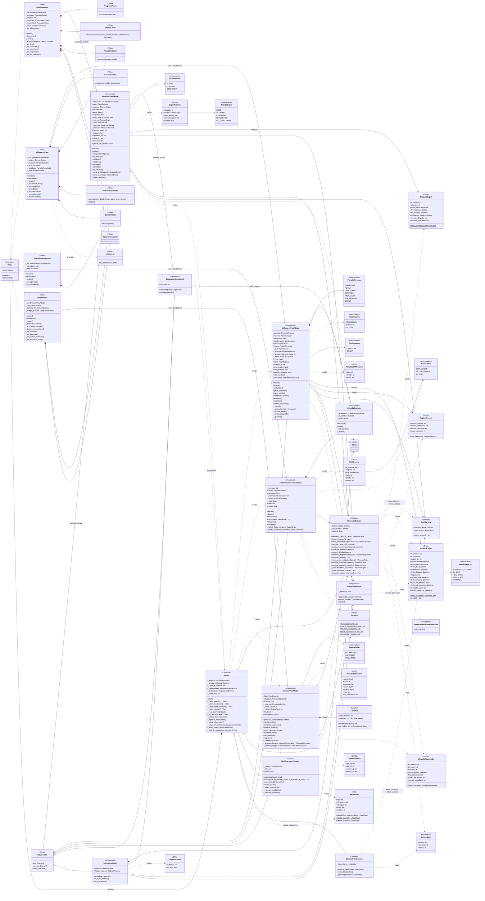

```mermaid
classDiagram
direction LR
class Vista {
  <<Interface>>
  +view: ft.View
  +montar()
  +desmontar()
}
class Router {
  <<Controller>>
  -_reservas: ReservasService
  -_almacen: AlmacenReserva
  -_cajon_a_reservar: str
  -_notificaciones: NotificacionesService
  -_dispositivos: DispositivosService
  -_token_fcm: str
  +ir(ruta)
  -_crear_reservar() Vista
  -_crear_mi_reserva() Vista
  -_crear_admin_reservas() Vista
  -_crear_escaner() Vista
  -_ir_a_reservar(etiqueta)
  -_es_administrador() bool
  -_activar_notificaciones()
  -_registrar_token(token)
  -_quitar_token_push()
  -_aviso_en_primer_plano(aviso: AvisoPush)
  -_aviso_tocado(aviso: AvisoPush)
  -_ruta_de_aviso(aviso: AvisoPush) str
}

class ReservarView {
  <<View>>
  -_vm: ReservarViewModel
  -_progreso: ProgresoPasos
  -_tarjetas: list
  -_recuadro_1: RecuadroCajon
  -_recuadro_2: RecuadroCajon
  -_inicio: CampoFormulario
  -_fin: ft.Dropdown
  +montar()
  +desmontar()
  -_render()
  -_al_tocar(etiqueta_cajon) Handler
  -_on_fin(e)
  -_on_continuar(e)
  -_on_cancelar(e)
  -_on_regresar(e)
  -_on_ver_reserva(e)
}
class MiReservaView {
  <<View>>
  -_vm: MiReservaViewModel
  -_banner: BannerEstado
  -_recuadro: RecuadroCajon
  -_qr: ft.Container
  -_resultado: PantallaResultado
  -_hoja: ft.BottomSheet
  +montar()
  +desmontar()
  -_render()
  -_sincronizar_hoja()
  -_on_cancelar(e)
  -_on_salida(e)
  -_on_extender(e)
  -_on_confirmar(e)
  -_on_resultado(e)
}
class AdminReservasView {
  <<View>>
  -_vm: AdminReservasViewModel
  -_contadores: dict
  -_lista: ft.Column
  +montar()
  +desmontar()
  -_render()
  -_on_regresar(e)
  -_on_escanear(e)
}
class EscanerView {
  <<View>>
  -_vm: EscanerViewModel
  -_con_camara: bool
  -_camara: flet_camera.Camera
  -_codigo_manual: CampoFormulario
  +montar()
  +desmontar()
  -_render()
  -_preparar_camara()
  -_sincronizar_camara()
  -_detener_transmision()
  -_on_cuadro(e)
  -_on_linterna(e)
  -_on_validar_manual(e)
  -_on_escanear_otro(e)
}
class TarjetaCajon {
  <<View>>
  +sincronizar(estado, texto_estado, tocable, seleccionada, atenuada)
}
class RecuadroCajon {
  <<View>>
  +mostrar(etiqueta, detalle)
}
class ProgresoPasos {
  <<View>>
  +sincronizar(paso: int)
}
class BannerEstado {
  <<View>>
  +mostrar(contenido, advertencia)
}
class PantallaResultado {
  <<View>>
  +mostrar(titulo, detalle, boton, icono, color, fondo)
  +ocultar()
}
class BannerAlerta {
  <<View>>
  +mostrar(alerta)
}
class CampoFormulario {
  <<View>>
}
class codigo_qr {
  <<Utility>>
  +qr_png(codigo)$ bytes
}

class PasoReserva {
  <<enumeration>>
  ELEGIR
  HORARIO
  CONFIRMAR
}
class CajonReserva {
  <<DTO>>
  +etiqueta: str
  +estado: EstadoCajon
  +texto_estado: str
  +seleccionado: bool
  +tocable: bool
}
class ReservarViewModel {
  <<ViewModel>>
  +ocupacion: OcupacionViewModel
  +paso: PasoReserva
  +bloqueo: BloqueoCajon
  +fin: datetime
  +alerta: Alerta
  +cargando: bool
  +tiene_reserva_activa: bool
  +reserva: ReservaCajon
  -_auth: AuthService
  -_reservas: ReservasService
  -_almacen: AlmacenReserva
  +/numero_paso: int
  +/cajones: list
  +/opciones_fin: list
  +/duracion: str
  +/resumen: list
  +/puede_ver_reserva: bool
  +iniciar()
  +liberar()
  +seleccionar(etiqueta)
  +set_fin(clave)
  +continuar()
  +confirmar()
  +regresar()
  +cancelar()
  +ver_reserva()
  -_error_al_bloquear(e: ReservaError)
  -_error_al_crear(e: ReservaError)
  -_soltar_bloqueo()
}

class PantallaReserva {
  <<enumeration>>
  CARGANDO
  ACTIVA
  CANCELADA
  EXPIRADA
  FINALIZADA
  SIN_RESERVA
  ERROR
}
class FaseReserva {
  <<enumeration>>
  CONFIRMADA
  RETRASO
  EN_USO
}
class Confirmacion {
  <<enumeration>>
  CANCELAR
  SALIDA
}
class ResultadoMiReserva {
  <<DTO>>
  +titulo: str
  +detalle: str
  +boton: str
}
class MiReservaViewModel {
  <<ViewModel>>
  +pantalla: PantallaReserva
  +reserva: ReservaCajon
  +conectado: bool
  +confirmacion: Confirmacion
  +procesando: bool
  +reglas: ReglasReserva
  -_auth: AuthService
  -_reservas: ReservasService
  -_almacen: AlmacenReserva
  -_aviso: AvisoDeCambios
  -_ciclo: Task
  +/fase: FaseReserva
  +/codigo_qr: str
  +/cronometro: tuple
  +/fin_proximo: bool
  +/puede_cancelar: bool
  +/en_uso: bool
  +/resultado: ResultadoMiReserva
  +iniciar()
  +liberar()
  +actualizar()
  +pedir_cancelar()
  +pedir_salida()
  +confirmar_accion()
  +extender()
  +regresar()
  +accion_resultado()
  -_correr()
  -_aplicar(servidor, id_usuario)
  -_revisar_tiempo()
  -_terminar(pantalla)
  -_guardar()
}

class FaseAdmin {
  <<enumeration>>
  POR_LLEGAR
  EN_TOLERANCIA
  EN_USO
}
class FilaReserva {
  <<DTO>>
  +id_reserva: str
  +etiqueta: str
  +fase: FaseAdmin
  +titulo: str
  +detalle: str
  +tiempo: str
}
class AdminReservasViewModel {
  <<ViewModel>>
  +reservas: list
  +reglas: ReglasReserva
  +cargando: bool
  -_reservas: ReservasService
  -_aviso: AvisoDeCambios
  -_ciclo: Task
  +/filas: list
  +/vacia: bool
  +iniciar()
  +liberar()
  +actualizar()
  +contar(fase: FaseAdmin) int
  +escanear()
  +regresar()
  -_fase(r: ReservaCajon) FaseAdmin
  -_limite_tolerancia(r: ReservaCajon) datetime
}
class FaseEscaner {
  <<enumeration>>
  ESCANEANDO
  VALIDANDO
  RESULTADO
}
class ResultadoEscaner {
  <<DTO>>
  +valido: bool
  +titulo: str
  +subtitulo: str
  +cajon: tuple
  +motivo: tuple
  +filas: list
  +fila_destacada: str
}
class EscanerViewModel {
  <<ViewModel>>
  +fase: FaseEscaner
  +resultado: ResultadoEscaner
  +linterna: bool
  -_reservas: ReservasService
  -_lector: LectorQr
  -_reglas: ReglasReserva
  +/titulo: str
  +/escaneando: bool
  +procesar_cuadro(imagen: bytes)
  +validar(codigo)
  +cancelar_validacion()
  +alternar_linterna()
  +error_camara(mensaje)
  +escanear_otro()
  +ver_reservas()
  +regresar()
  -_confirmar(codigo)
  -_aceptado(llegada: LlegadaRegistrada) ResultadoEscaner
  -_rechazo(codigo, e: ReservaError) ResultadoEscaner
}

class OcupacionViewModel {
  <<ViewModel>>
  +/cajones: list
  +cajon(etiqueta) CajonVista
  +reservar(etiqueta)
}
class AvisoDeCambios {
  <<ViewModel>>
  -_ocupacion: OcupacionViewModel
  -_al_cambiar: Callable
  -_ultima: tuple
  +escuchar()
  +dejar()
  -_firma() tuple
  -_revisar()
}
class InicioViewModel {
  <<ViewModel>>
  +reserva: ReservaCajon
  +/tarjeta_reserva: TarjetaReserva
  +actualizar_reserva()
  +ir_a_mi_reserva()
  +ir_a_reservas()
}
class TarjetaReserva {
  <<DTO>>
  +subtitulo: str
  +en_uso: bool
}
class formato {
  <<Utility>>
  +hora_local(fecha)$ str
  +cuenta_regresiva(restante)$ str
  +hh_mm_ss(restante)$ str
  +horas_totales(inicio, fin)$ str
  +id_corto(id_reserva)$ str
}
class Alerta {
  <<DTO>>
}
class Observable {
  <<Core>>
  +add_listener(l)
  +remove_listener(l)
  +notify_listeners()
}

class ReservasService {
  <<Service>>
  -_token_factory: Callable
  -_url_factory: Callable
  -_timeout: float
  +bloquear_cajon(id_cajon) BloqueoCajon
  +liberar_bloqueo(id_cajon)
  +crear_reserva(id_cajon, inicio, fin) ReservaCajon
  +cancelar_reserva(id_reserva)
  +extender_reserva(id_reserva) datetime
  +confirmar_salida(id_reserva)
  +reglas() ReglasReserva
  +confirmar_llegada(codigo_qr) LlegadaRegistrada
  +reservas_activas() list
  +reserva_por_codigo(codigo_qr) ReservaCajon
  +obtener_reserva(id_reserva) ReservaCajon
  +reserva_vigente(id_usuario) ReservaCajon
  -_consultar(filtros, columnas) ReservaCajon
  -_invocar(funcion, cuerpo) dict
  -_peticion(metodo, ruta, nombre) Any
}
class ReservaError {
  <<Exception>>
  +codigo: str
  +mensaje: str
  +status: int
}
class ReservasNoDisponiblesError {
  <<Exception>>
  +sin_red: bool
}
class AlmacenReserva {
  <<Repository>>
  -_directorio: Path
  +guardar(id_usuario, reserva)
  +leer(id_usuario) ReservaCajon
  +borrar()
}
class LectorQr {
  <<Service>>
  -_lado_maximo: int
  -_detector: cv2.QRCodeDetector
  +leer(imagen: bytes) str
  +es_codigo_del_sistema(texto)$ bool
}
class AuthService {
  <<Service>>
  +/usuario_actual: Usuario
  +/hay_sesion_activa: bool
  +token_acceso() str
}

class NotificacionesService {
  <<Service>>
  -_config: ConfigFirebase
  -_fcm: Any
  +/activa: bool
  +soportada(page)$ bool
  +iniciar(page, al_renovar_token, al_mensaje, al_tocar) str
  +aviso_inicial() AvisoPush
  +olvidar_token()
  -_token_renovado(e)
  -_mensaje_recibido(e)
  -_mensaje_tocado(e)
}
class AvisoPush {
  <<DTO>>
  +tipo: str
  +id_reserva: str
  +id_cajon: str
  +titulo: str
  +cuerpo: str
  +desde(titulo, cuerpo, datos)$ AvisoPush
  +desde_evento(e)$ AvisoPush
  +desde_mapa(m)$ AvisoPush
}
class DispositivosService {
  <<Service>>
  -_token_factory: Callable
  +registrar_token(token, plataforma)
  +borrar_token(token)
  -_peticion(metodo, ruta, nombre)
}
class ConfigFirebase {
  <<Config>>
  +api_key: str
  +app_id: str
  +sender_id: str
  +project_id: str
}

class EstadoReserva {
  <<enumeration>>
  PENDIENTE_LLEGADA
  EN_USO
  FINALIZADA
  CANCELADA
  EXPIRADA
}
class ReservaCajon {
  <<Entity>>
  +id_reserva: str
  +id_cajon: int
  +codigo_qr: str
  +estado: EstadoReserva
  +fecha_inicio: datetime
  +fecha_fin: datetime
  +cronometro: datetime
  +fecha_llegada: datetime
  +etiqueta: str
  +minutos_tolerancia: int
  +fecha_usuario: datetime
  +aviso_fin_enviado: bool
  +fecha_cancelacion: datetime
  +/etiqueta_cajon: str
  +/limite_tolerancia: datetime
  +from_dict(datos)$ ReservaCajon
  +to_dict() dict
}
class BloqueoCajon {
  <<Entity>>
  +id_cajon: int
  +etiqueta: str
  +fecha_inicio: datetime
  +fin_minimo: datetime
  +fin_maximo: datetime
  +bloqueado_hasta: datetime
  +minutos_llegada: int
  +minutos_tolerancia: int
  +from_dict(datos)$ BloqueoCajon
}
class ReglasReserva {
  <<Entity>>
  +minutos_llegada: int
  +minutos_tolerancia: int
  +minutos_aviso_fin: int
  +horas_maximas: int
  +from_dict(datos)$ ReglasReserva
}
class LlegadaRegistrada {
  <<Entity>>
  +id_reserva: str
  +id_cajon: int
  +etiqueta: str
  +fecha_llegada: datetime
  +fecha_fin: datetime
  +medio_transporte: str
  +nombre_estudiante: str
  +from_dict(datos)$ LlegadaRegistrada
}
class EstadoCajon {
  <<enumeration>>
  LIBRE
  OCUPADO
  RESERVADO
  BLOQUEADO
  NO_CONECTADO
}

Router "1" *-- "0..*" Vista : _activas
Router ..> ReservarViewModel : create
Router ..> MiReservaViewModel : create
Router ..> AdminReservasViewModel : create
Router ..> EscanerViewModel : create
Router o-- ReservasService
Router o-- AlmacenReserva
Router o-- NotificacionesService
Router o-- DispositivosService
Router ..> AvisoPush : decide ruta destino
OcupacionViewModel ..> Router : al_reservar

Vista <|.. ReservarView
Vista <|.. MiReservaView
Vista <|.. AdminReservasView
Vista <|.. EscanerView
ReservarView --> ReservarViewModel : _vm / add_listener
MiReservaView --> MiReservaViewModel : _vm / add_listener
AdminReservasView --> AdminReservasViewModel : _vm / add_listener
EscanerView --> EscanerViewModel : _vm / add_listener
ReservarView *-- ProgresoPasos
ReservarView *-- "4" TarjetaCajon
ReservarView *-- "2" RecuadroCajon
ReservarView *-- "3" BannerAlerta
ReservarView *-- CampoFormulario
MiReservaView *-- BannerEstado
MiReservaView *-- RecuadroCajon
MiReservaView *-- PantallaResultado
MiReservaView *-- BannerAlerta
MiReservaView ..> codigo_qr : qr_png()
AdminReservasView *-- BannerAlerta
EscanerView *-- BannerAlerta
EscanerView *-- CampoFormulario : captura manual

Observable <|-- ReservarViewModel
Observable <|-- MiReservaViewModel
Observable <|-- AdminReservasViewModel
Observable <|-- EscanerViewModel
Observable <|-- OcupacionViewModel
Observable <|-- InicioViewModel
ReservarViewModel o-- OcupacionViewModel : estados en vivo
ReservarViewModel --> PasoReserva
ReservarViewModel ..> CajonReserva : create
ReservarViewModel --> BloqueoCajon : bloqueo
ReservarViewModel --> ReservasService
ReservarViewModel --> AlmacenReserva
ReservarViewModel --> AuthService
MiReservaViewModel *-- AvisoDeCambios
MiReservaViewModel --> PantallaReserva
MiReservaViewModel ..> FaseReserva
MiReservaViewModel --> Confirmacion
MiReservaViewModel ..> ResultadoMiReserva : create
MiReservaViewModel --> ReservaCajon : reserva
MiReservaViewModel --> ReglasReserva : reglas
MiReservaViewModel --> ReservasService
MiReservaViewModel --> AlmacenReserva
MiReservaViewModel --> AuthService
MiReservaViewModel ..> formato
AdminReservasViewModel *-- AvisoDeCambios
AdminReservasViewModel ..> FilaReserva : create
AdminReservasViewModel ..> FaseAdmin
AdminReservasViewModel --> ReservasService
AdminReservasViewModel ..> formato
EscanerViewModel --> FaseEscaner
EscanerViewModel ..> ResultadoEscaner : create
EscanerViewModel --> ReservasService
EscanerViewModel *-- LectorQr : _lector
EscanerViewModel ..> LlegadaRegistrada
EscanerViewModel ..> formato
InicioViewModel *-- AvisoDeCambios
InicioViewModel o-- OcupacionViewModel
InicioViewModel ..> TarjetaReserva : create
InicioViewModel --> ReservasService
InicioViewModel --> AlmacenReserva
AvisoDeCambios o-- OcupacionViewModel : add_listener
FilaReserva --> FaseAdmin
CajonReserva --> EstadoCajon
ReservarViewModel ..> Alerta
MiReservaViewModel ..> Alerta
EscanerViewModel ..> Alerta
AdminReservasViewModel ..> Alerta

ReservasService ..> AuthService : token_factory = token_acceso
ReservasService ..> ReservaCajon : create
ReservasService ..> BloqueoCajon : create
ReservasService ..> ReglasReserva : create
ReservasService ..> LlegadaRegistrada : create
ReservasService ..> ReservaError : raise
ReservasService ..> ReservasNoDisponiblesError : raise
AlmacenReserva ..> ReservaCajon : reserva_activa.json
ReservaCajon --> EstadoReserva
DispositivosService ..> AuthService : token_factory = token_acceso
DispositivosService ..> ReservaError : raise
NotificacionesService ..> ConfigFirebase
NotificacionesService ..> AvisoPush : create
```
